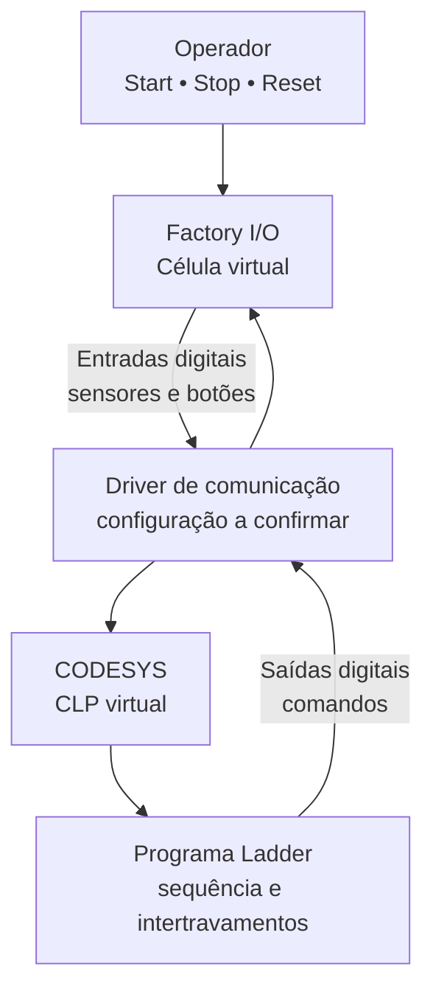

# Arquitetura do sistema

> Status: arquitetura inicial  
> Projeto em desenvolvimento

## Visão geral

A célula utiliza o **Factory I/O** para representar o processo industrial e o **CODESYS** para executar a lógica de controle do CLP virtual em linguagem Ladder.

O Factory I/O fornece os estados dos sensores e recebe os comandos dos atuadores. O CODESYS processa esses sinais, aplica a lógica de controle e devolve os comandos à simulação.

## Camadas do projeto

| Camada | Ferramenta/Elemento | Responsabilidade |
|---|---|---|
| Processo | Factory I/O | Simular peças, sensores, esteiras e atuadores |
| Comunicação | Driver do Factory I/O | Transportar os sinais entre a simulação e o CLP virtual |
| Controle | CODESYS | Executar o programa e disponibilizar as variáveis de I/O |
| Lógica | Ladder | Implementar partida, parada, reset, sequência e intertravamentos |
| Documentação | GitHub | Registrar arquitetura, mapa de I/O, testes e falhas |

## Fluxo dos sinais

### Da planta para o controlador

1. Um botão é acionado ou um sensor detecta uma condição no Factory I/O.
2. O driver transfere o valor como uma entrada digital.
3. O CODESYS atualiza a variável correspondente, normalmente endereçada com `%IX`.
4. O programa Ladder utiliza esse valor para decidir o próximo comando.

### Do controlador para a planta

1. A lógica Ladder determina que um atuador deve ser acionado.
2. O CODESYS atualiza a variável de saída correspondente, normalmente endereçada com `%QX`.
3. O driver transfere o comando ao Factory I/O.
4. A célula virtual aciona a esteira, o empurrador ou outro atuador mapeado.

## Blocos funcionais previstos

| Bloco | Função |
|---|---|
| Comando geral | Partida, parada e reset |
| Memória de operação | Manter o estado de funcionamento por meio de `M_Run` |
| Transporte | Controlar as esteiras da célula |
| Detecção | Ler os sensores de presença e posição |
| Atuação | Comandar os empurradores/atuadores |
| Sequenciamento | Organizar a ordem das etapas do processo |
| Intertravamento | Impedir comandos incompatíveis ou simultâneos |
| Diagnóstico | Facilitar a identificação de erros de comunicação e lógica |

## Sinais já identificados

As entradas abaixo já aparecem declaradas no programa:

| Sinal | Endereço | Função |
|---|---:|---|
| `I_Start` | `%IX21.0` | Solicitação de partida |
| `I_Reset` | `%IX21.1` | Reinicialização do sistema |
| `I_Stop` | `%IX21.2` | Solicitação de parada |

O levantamento completo está em [Mapa de entradas e saídas](./io-map.md).

## Limites da versão atual

Ainda precisam ser confirmados:

- Driver/protocolo utilizado na comunicação
- Endereços de todos os sensores
- Endereços de todas as saídas
- Quantidade final de esteiras e atuadores controlados
- Sequência operacional definitiva
- Comportamento seguro em parada e reset

Esses itens serão atualizados somente após validação no Factory I/O e no CODESYS.
